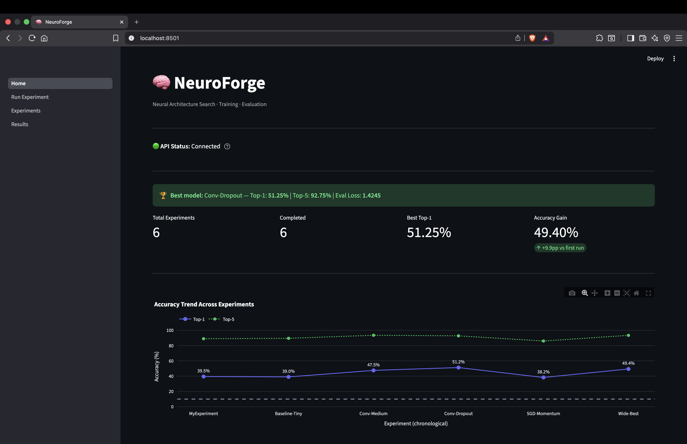
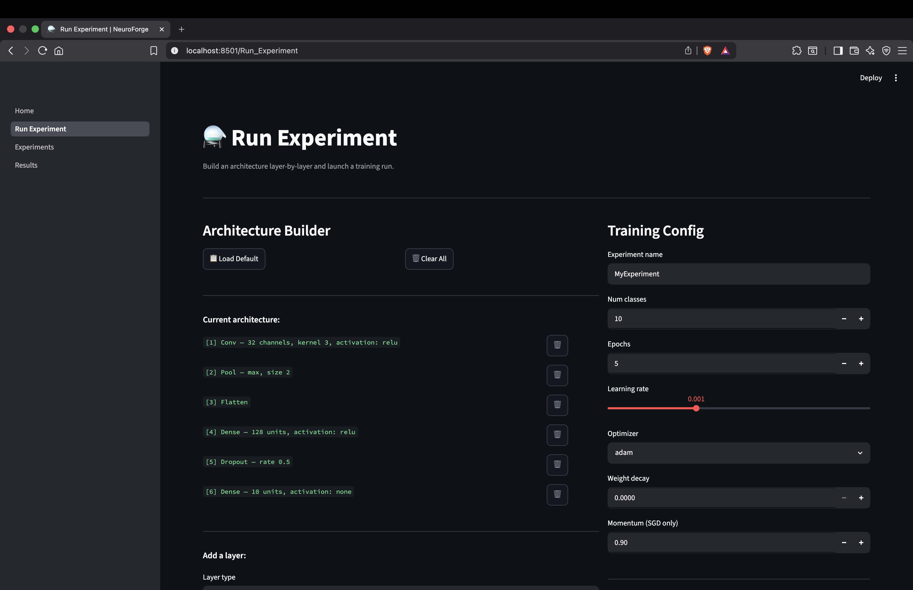
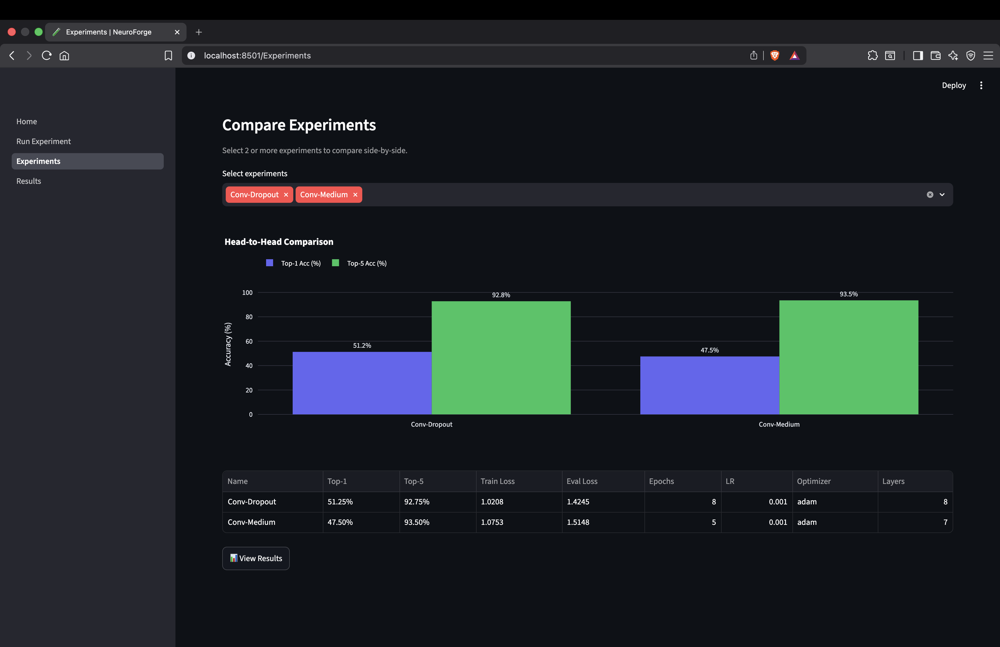
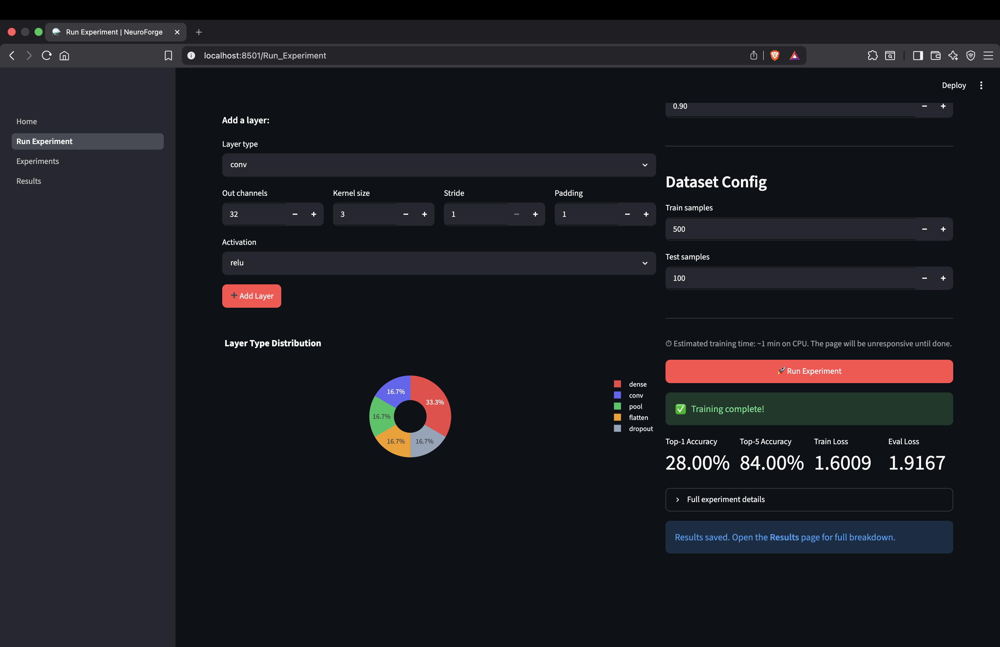
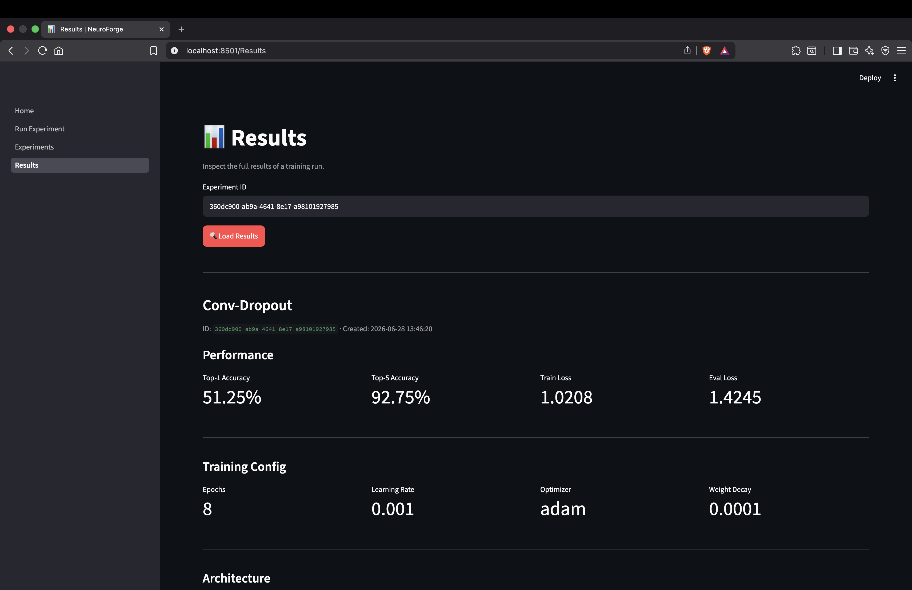
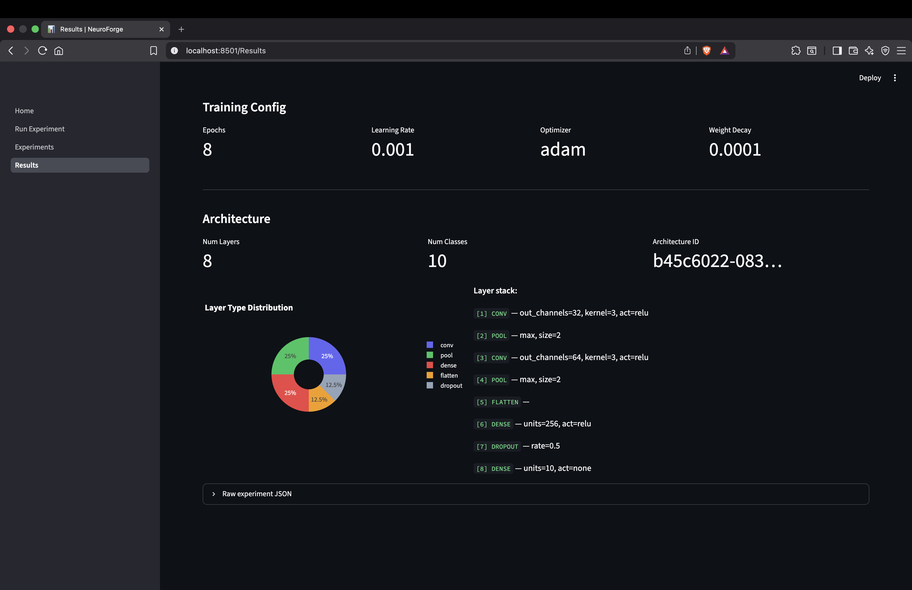

# 🧠 NeuroForge

> A full-stack machine learning experimentation engine built on PyTorch.  
> Define neural architectures, train them on CIFAR-10, track every experiment automatically,  
> and explore results through a REST API and interactive Streamlit dashboard.  

---

## What Makes This Different

Most ML projects are notebooks or scripts : untestable, tightly coupled to specific frameworks, impossible to extend cleanly. NeuroForge deliberately applies **hexagonal (ports and adapters) architecture** to an ML system:

- The domain layer has **zero knowledge of PyTorch, FastAPI, or Streamlit**
- Every ML operation flows through a typed abstract port : swap PyTorch for JAX, flat files for PostgreSQL, or FastAPI for a CLI without touching domain logic
- Every entity and use case is unit-testable with no I/O, no GPU, and no network

---

## Architecture

```
packages/ml-engine/
│
├── api/                            # FastAPI REST layer (driver adapter)
│   ├── main.py                     # App factory, CORS, startup
│   ├── schemas.py                  # Pydantic v2 request/response models
│   ├── dependencies.py             # Dependency injection wiring
│   └── routers/
│       ├── experiments.py          # POST /experiments/run, GET /experiments, GET /experiments/{id}
│       └── health.py               # GET /health
│
├── dashboard/                      # Streamlit web UI (driver adapter)
│   ├── Home.py                     # Entry point — health check, quick stats, trend chart
│   ├── config.py                   # API URL, timeout config
│   ├── components/
│   │   ├── api_client.py           # HTTP wrapper (NeuroForgeClient)
│   │   ├── charts.py               # Plotly chart builders
│   │   └── ui_helpers.py           # Field extractors, formatters, badges
│   └── pages/
│       ├── 01_Run_Experiment.py    # Layer builder UI + training form
│       ├── 02_Experiments.py       # Experiment browser + comparison panel
│       └── 03_Results.py           # Deep-dive: metrics, config, architecture
│
├── neuroforge_core/                # Core ML engine — zero web/UI dependencies
│   │
│   ├── domain/                     # Inner hexagon — pure Python, no I/O
│   │   ├── entities/               # Core business objects
│   │   │   ├── architecture.py     # Layer definitions, architecture graph
│   │   │   ├── training_run.py     # Run state machine (pending → running → done)
│   │   │   ├── experiment.py       # Experiment record
│   │   │   ├── experiment_snapshot.py  # Serialisable experiment snapshot
│   │   │   ├── evaluation_result.py    # EvaluationResult, TrainingMetrics
│   │   │   ├── dataset.py          # Dataset entity
│   │   │   └── model_artifact.py   # Trained model reference
│   │   │
│   │   ├── interfaces/             # Ports — abstract contracts (ABC)
│   │   │   ├── architecture_generator_port.py  # ArchitectureGeneratorPort
│   │   │   ├── dataset_port.py                 # DatasetSourcePort
│   │   │   ├── evaluator_port.py               # EvaluatorPort
│   │   │   ├── experiment_tracker_port.py      # ExperimentTrackerPort
│   │   │   ├── i_experiment_repository.py      # IExperimentRepository
│   │   │   ├── i_model_compiler.py             # IModelCompiler
│   │   │   ├── i_model_evaluator.py            # IModelEvaluator
│   │   │   ├── model_trainer.py                # IModelTrainer
│   │   │   └── trainer_port.py                 # TrainerPort
│   │   │
│   │   └── value_objects/          # Immutable config and metrics
│   │       ├── training_config.py  # LR, epochs, optimizer, weight decay
│   │       ├── evaluation_config.py
│   │       ├── evaluation_metrics.py
│   │       ├── training_metrics.py
│   │       ├── search_space.py     # Layer count, channel bounds
│   │       ├── layer.py            # Typed layer definitions
│   │       └── preprocessing_config.py
│   │
│   ├── application/                # Use cases — orchestrate ports, no framework deps
│   │   ├── train_model.py          # Training orchestration
│   │   ├── experiment_utils.py
│   │   ├── dataset_management/
│   │   │   └── dataset_manager.py  # DatasetManager use case
│   │   └── use_cases/
│   │       ├── architecture_search.py          # ArchitectureSearchUseCase
│   │       ├── evaluate_model_use_case.py      # EvaluateModelUseCase
│   │       └── experiment_tracking_use_case.py # ExperimentTrackingUseCase
│   │
│   └── infrastructure/             # Adapters — implement ports with real frameworks
│       ├── adapters/
│       │   ├── pytorch_model_compiler.py    # IModelCompiler → torch.nn.Module
│       │   ├── pytorch_evaluator.py         # EvaluatorPort + IModelEvaluator
│       │   └── file_experiment_tracker.py   # IExperimentRepository (JSON on disk)
│       ├── datasets/
│       │   ├── cifar10_loader.py            # DatasetSourcePort → CIFAR-10
│       │   ├── dataloader_factory.py
│       │   ├── dataset_validator.py
│       │   └── preprocessing.py
│       ├── generators/
│       │   └── random_architecture_generator.py  # ArchitectureGeneratorPort
│       └── training/
│           └── pytorch_trainer.py           # IModelTrainer + TrainerPort
│
├── scripts/
│   └── seed_experiments.py         # Seeds 5 real training runs via API
│
└── tests/                          # 51+ tests across all layers
    ├── domain/                     # Pure unit tests — no I/O
    ├── application/                # Use case tests with mocked ports
    ├── infrastructure/             # Adapter integration tests
    ├── dashboard/                  # HTTP-mocked dashboard tests
    ├── unit/                       # Fine-grained unit tests
    ├── test_day6/                  # Compiler + evaluator tests
    ├── test_day7/                  # Experiment tracking tests
    └── test_day8_api.py            # FastAPI endpoint tests
```

### The Dependency Rule

Arrows point inward only : outer layers know about inner layers, never the reverse:

```
Dashboard (HTTP) ──→ API ──→ Application ──→ Domain ←── Infrastructure
```

The domain layer has no `import torch`, no `import fastapi`, no `import streamlit`.  
The application layer calls ports : it never imports a concrete adapter directly.

---

## Port → Adapter Map

| Port | Adapter | Swap candidate |
|---|---|---|
| `ArchitectureGeneratorPort` | `RandomArchitectureGenerator` | Bayesian optimizer, DARTS |
| `DatasetSourcePort` | `CIFAR10Loader` | FashionMNIST, Tiny ImageNet |
| `IModelCompiler` | `PyTorchModelCompiler` | JAX compiler, ONNX exporter |
| `IModelTrainer` / `TrainerPort` | `PyTorchTrainer` | JAX trainer, sklearn wrapper |
| `EvaluatorPort` / `IModelEvaluator` | `PyTorchEvaluator` | TorchMetrics, custom eval |
| `IExperimentRepository` | `FileExperimentTracker` | SQLite, PostgreSQL, MLflow |
| `ExperimentTrackerPort` | `FileExperimentTracker` | W&B, Comet, Neptune |

---

## Tech Stack

| Layer | Technology |
|---|---|
| ML Framework | PyTorch 2.2 + TorchVision |
| REST API | FastAPI + Pydantic v2 |
| Dashboard | Streamlit 1.35 + Plotly |
| Architecture pattern | Hexagonal (Ports & Adapters) |
| Dataset | CIFAR-10 (10-class image classification) |
| Testing | pytest — 51+ tests |
| Python | 3.11+ |

---

## Quickstart

```bash
# Clone
git clone https://github.com/YOUR_USERNAME/neuroforge.git
cd neuroforge/packages/ml-engine

# Install
pip install -e ".[dev]"
pip install -r requirements-dashboard.txt

# Terminal 1 — API server
uvicorn api.main:app --reload --port 8000

# Terminal 2 — Dashboard
streamlit run dashboard/Home.py --server.port 8501
```

Open `http://localhost:8501`. API docs at `http://localhost:8000/docs`.

---

## Running Your First Experiment

**Via the dashboard:**
1. Go to **Run Experiment** in the sidebar
2. Click **Load Default** to pre-fill a working architecture
3. Set Epochs to `5`, leave other defaults
4. Click **🚀 Run Experiment**
5. View results in the **Results** page

**Via the API directly:**
```bash
curl -X POST http://localhost:8000/experiments/run \
  -H "Content-Type: application/json" \
  -d '{
    "name": "QuickTest",
    "architecture": {
      "num_classes": 10,
      "layers": [
        {"type": "conv", "out_channels": 32, "kernel_size": 3,
         "stride": 1, "padding": 1, "activation": "relu"},
        {"type": "pool", "pool_size": 2, "stride": 2, "pool_type": "max"},
        {"type": "flatten"},
        {"type": "dense", "units": 128, "activation": "relu"},
        {"type": "dense", "units": 10, "activation": "none"}
      ]
    },
    "training_config": {
      "epochs": 5, "learning_rate": 0.001,
      "optimizer": "adam", "weight_decay": 0.0, "momentum": 0.9
    },
    "dataset_config": {"train_samples": 1000, "test_samples": 200}
  }'
```

---

## Experiment Results

Six training runs across different architectures, depths, and optimizers:

| Experiment | Architecture | Optimizer | Epochs | Samples | Top-1 | Top-5 |
|---|---|---|---|---|---|---|
| **ConvDropout-Full-CIFAR10** | **2 conv + dropout + dense** | **Adam** | **40** | **50,000 (full)** | **74.0%** | **97.8%** |
| Baseline-Tiny | 1 conv + dense | Adam | 3 | 1,000 | 39.0% | 74.5% |
| Conv-Medium | 2 conv + 2 dense | Adam | 5 | 2,000 | 47.5% | 81.2% |
| Conv-Dropout | 2 conv + dropout + dense | Adam | 8 | 2,000 | 51.2% | 84.1% |
| SGD-Momentum | 2 conv + 2 dense | SGD | 5 | 2,000 | 38.2% | 72.8% |
| Wide-Best | 2 wide conv + dropout + dense | Adam | 10 | 3,000 | 49.4% | 82.6% |
| MyExperiment | 1 conv + dense | Adam | 1 | 500 | 39.5% | 74.0% |

| Experiment | Architecture | Optimizer | 
Key findings from the comparison:
- **Dropout regularization** was the single largest accuracy lever — outperforming both added width and added depth
- **Adam consistently outperformed SGD** at equivalent epoch counts on this dataset and learning rate
- **Diminishing returns** visible past 8 epochs with 2,000 training samples — Wide-Best ran 10 epochs on 3,000 samples yet underperformed Conv-Dropout

> *These runs use small data subsets for demo speed. Full CIFAR-10 (50k samples, 50 epochs) with this architecture class reaches 80–85%.*

---

## API Reference

Full interactive docs at `http://localhost:8000/docs`.

| Method | Endpoint | Description |
|---|---|---|
| `GET` | `/health` | Health check |
| `POST` | `/experiments/run` | Submit architecture + training config, returns results |
| `GET` | `/experiments` | List all tracked experiments |
| `GET` | `/experiments/{experiment_id}` | Get single experiment detail |

---

## Running Tests

```bash
cd packages/ml-engine
python -m pytest tests/ -v
```

Slow tests (real PyTorch training) are marked and skippable:
```bash
python -m pytest tests/ -m "not slow"
```

Test coverage by layer:

| Layer | Test file(s) |
|---|---|
| Domain entities | `tests/domain/`, `tests/unit/domain/` |
| Use cases | `tests/application/`, `tests/unit/application/` |
| Infrastructure | `tests/infrastructure/`, `tests/test_day6/`, `tests/unit/infrastructure/` |
| Experiment tracking | `tests/test_day7/` |
| REST API | `tests/test_day8_api.py` |
| Dashboard | `tests/dashboard/` |

---

## Screenshots

| Home | Experiments |
|---|---|
|  |  |

| Compare Experiments | Results |
|---|---|
|  |  |

|  |  |


---

## License

MIT
